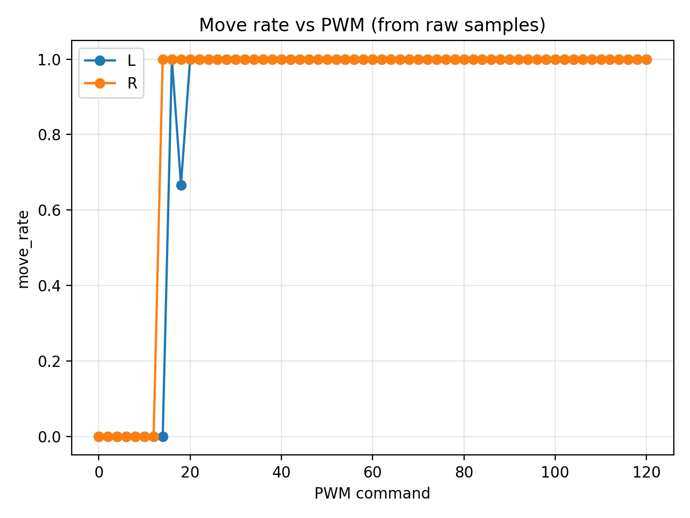

# Pololu-3pi-Autonomous-Search-Return
Control code for Pololu 3pi+ 32U4 robot.

1. **Start-up initialization** (line sensor calibration + reference heading)
2. **Grid/coverage-style exploration** inside a bounded area (track edge + “virtual boundary”)
3. **Magnet detection**
4. **Return-to-home** when a magnet is found **or** when a time limit expires

> Coordinate convention used everywhere in this repo:
> - `x` forward, `y` left
> - heading `th` is **continuous** and **right turn is negative**

---

## Task map

The mission is designed around the following map:

- PDF: **[`figure/Map_A2.pdf`](figure/Map_A2.pdf)**

> GitHub may not render PDFs inline in the README on all views.
> Click the link above to open the map.

---

## Demo video (YouTube)

GitHub READMEs do **not** allow an embedded YouTube player (iframes are blocked),  
but you can add a clickable thumbnail like this:

Replace `VIDEO_ID_HERE` with your video ID.

> If you want **inline playback** on GitHub, the usual approach is to upload an `.mp4`
> to the repository (or to a GitHub Release) and link it in the README.

---

## Motor deadzone / drive characterization

Placeholders + example plots live in `figure/`.

Example (moving probability vs PWM):

> You can replace/extend this section with your final deadzone figure(s) and notes.

---

## Repository layout

- `Main_Firmware/`
  - `Main_Firmware.ino` — **the main mission firmware** (init → explore → detect → return home)
  - `Encoders3pi.h`, `Motors3pi.h`, `PID3pi.h`, `WheelSpeedCtrl3pi.h`, `OdomDiff2W_Basic.h`
  - `LineSensorsRC.h`, `MagnetDetector3pi.h`
- `Modules/`
  - Standalone “API showcase” sketches for each module (LineSensors / Magnet / Motion / Odometry)
- `calibration tool/`
  - Calibration and measurement sketches:
    - `metersPerCountTest/` — meters-per-count calibration
    - `WheelBaseCalib_Right360/` — effective wheelbase via in-place rotation
    - `BacklashTest/` — backlash measurement helper
    - `Ratio_Deadzone_Scan/` — deadzone + L/R ratio scan tooling (includes MATLAB script + results)
- `figure/`
  - Map PDF + plots

---

## Dependencies

### Hardware
- Pololu **3pi+ 32U4**

### Arduino libraries
- **Arduino core** for ATmega32U4
- **Pololu LIS3MDL** library (for the magnetometer) — header: `LIS3MDL.h`

> The rest of the hardware access (encoders, motors, RC line sensors) is implemented in this repo.

---

## Quick start

1. Open: `Main_Firmware/Main_Firmware.ino` in Arduino IDE
2. Select a board compatible with **ATmega32U4** (3pi+ 32U4)
3. Install the **Pololu LIS3MDL** library
4. Compile & upload

On power-up, the robot will:
- calibrate and establish a reference heading (“east”)
- drive forward to set a virtual boundary origin
- enter exploration mode (edge avoidance + virtual boundary)
- continuously check the magnetometer
- return home when triggered

---

## How the mission works (high level)

### 1) Initialization
- Line sensors start non-blocking calibration for `LINE_CALIB_MS`
- Robot spins in place for `INIT_TURN_DEG`
- A reference heading `eastRefTh` is saved and turned into a unit vector `(eastUx, eastUy)`
- After a short settle, the robot drives forward `INIT_FWD_M`

### 2) Exploration
- Cruise command is shaped as:
  - `avg` (forward) and `diff` (turn) with acceleration limiting
  - wheel targets: `tgtL = avg - diff`, `tgtR = avg + diff`
- Edge detection from normalized line sensors (0..1000):
  - if edge pattern is detected → hard stop → pivot turn → settle → resume
- Virtual boundary:
  - project pose onto “east” axis: `s = eastUx*x + eastUy*y`
  - once armed, if `s` crosses back past `VBOUND_S0_M` (with hysteresis) → corrective pivot toward east

### 3) Magnet detection
- During exploration, magnet is checked continuously.
- If magnet is detected, the firmware switches immediately to **terminate / return-home**.

### 4) Return home
- Stop, then turn to face origin `(0,0)`
- Drive straight the current odometry distance back to origin
- Hold

---

## Where to tune parameters

The main knobs are at the top of **`Main_Firmware/Main_Firmware.ino`**:
- timing (`LINE_CALIB_MS`, settle times, time limit)
- thresholds (line sensor edge/white thresholds, stop detection)
- speed targets (`initTurnDiffCps`, `exploreCruiseAvgCps`, `exploreTurnDiffCps`)
- motion shaping limits (accel limiters, PID clamps)
- virtual boundary settings (`VBOUND_*`)

---

## Notes / gotchas

- **Single-translation-unit implementations**
  - Some headers use the pattern:
    - `#define ENCODERS3PI_IMPLEMENTATION`
    - `#define MAGNET_DETECTOR3PI_IMPLEMENTATION`
  - These must be defined in **exactly one** `.ino/.cpp` that includes the header.
- **Arduino auto-prototype**
  - The main firmware forward-declares enums before includes to avoid Arduino’s auto-generated
    prototype edge cases.

---

## License
Add your preferred license here (MIT/BSD/GPL/etc.).
