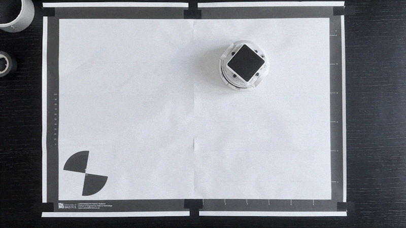
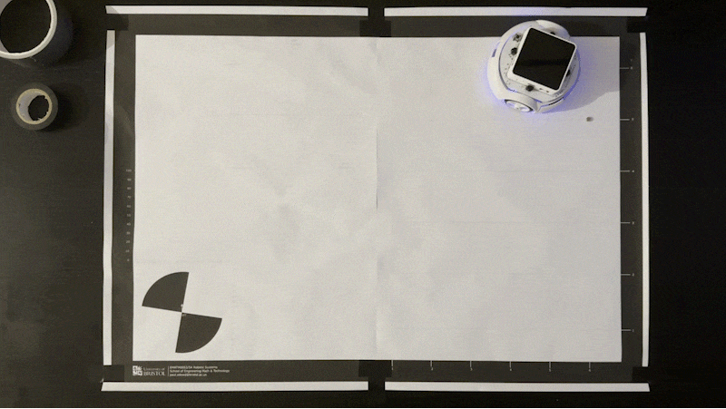
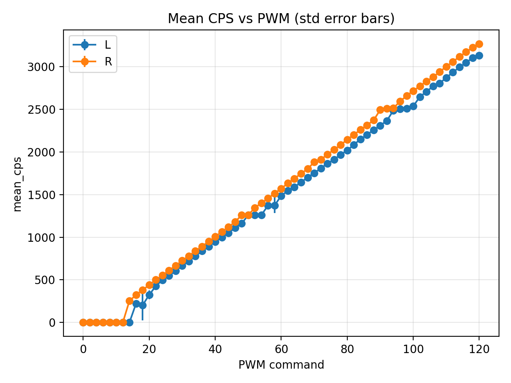
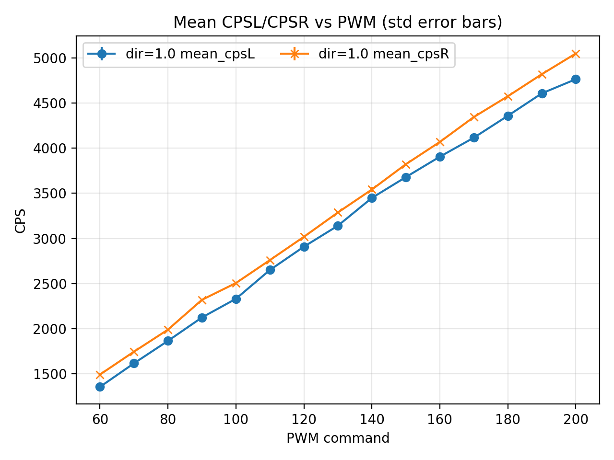
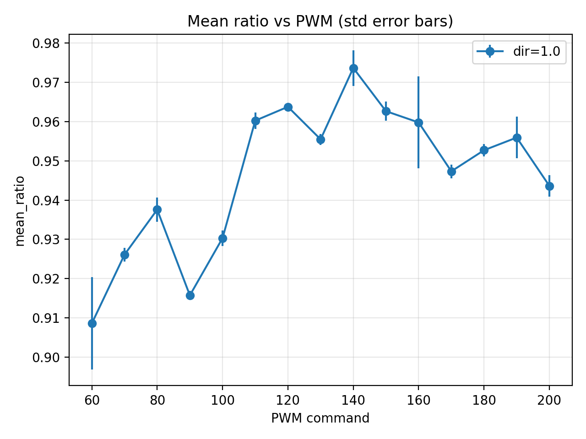

# Pololu-3pi-Autonomous-Search-Return
Control code for Pololu 3pi+ 32U4 robot.

1. **Start initialization** (sensor calibration + establish a reference heading)
2. **Coverage-style search** for a magnet inside the mapped area  
   (line-edge avoidance + a “virtual boundary” to keep the robot inside the region)
3. **Return-to-home trigger**: **magnet found** OR **time limit reached**
4. **Return home** (stop → turn toward origin → drive back → hold)

Designed for **power-on auto-run**: flash the main firmware, power the robot, it starts the mission.

---

## Task map

Click to open the PDF.

  

<i>Source: University of Bristol — Paul O’Dowd. File: <code>figure/Map_A2.pdf</code>.</i>

---

## Demo video

| Demo 1 | Demo 2 |
|---|---|
| 
 <b>Timeout</b> <a href="https://youtu.be/SrgynV45UOs">▶ Play on YouTube</a>
 | 
 <b>Magnet</b> <a href="https://youtu.be/jjI0YxvIigU">▶ Play on YouTube</a>
 |

## Motor deadzone & PWM ratio calibration

This repository includes calibration sketches to measure each wheel’s **deadzone** and the **left/right PWM ratio**
so wheel-speed control becomes more repeatable.

The figures below are **example results from my own robot**. Your numbers may differ due to motor variance, gearbox friction,
battery level, and surface conditions—so please run the calibration on your own setup.

<table>
  <tr>
    <td align="center" width="50%">
      
    </td>
    <td align="center" width="50%">
      
    </td>
  </tr>
  <tr>
    <td align="center" width="50%">
      
    </td>
    <td align="center" width="50%">
      
    </td>
  </tr>
</table>
---

## Repository structure

- `Main_Firmware/`
  - Main mission firmware (FSM + motion shaping + odometry + sensor triggers)
- `Modules/`
  - Standalone “API showcase” sketches for individual modules (LineSensors / Magnet / Motion / Odometry)
- `calibration tool/`
  - Calibration & measurement sketches (straight counts, wheelbase turn, backlash measurement, deadzone scans, etc.)
- `figure/`
  - Map + README figures

---

## Dependencies

### Hardware
- Pololu **3pi+ 32U4**

### Arduino libraries
- **Pololu LIS3MDL** (magnetometer) — provides `LIS3MDL.h`

Everything else (encoders, motor driver layer, RC line sensors, odometry, speed control) is implemented in this repo.

---

## Quick start

1. Open `Main_Firmware/Main_Firmware.ino` in Arduino IDE
2. Select a board compatible with **ATmega32U4**
3. Install the **Pololu LIS3MDL** library
4. Build & upload

On power-up, the robot will:
- calibrate and establish a reference heading (“east” reference)
- drive forward to set the virtual boundary origin
- start exploration (edge avoidance + virtual boundary)
- continuously check the magnetometer
- return home when triggered (magnet or timeout)

---

## How it works (module relationships)

### Sensors
- **RC line sensors** — `LineSensorsRC.h`  
  Non-blocking RC charge/discharge timing, auto-calibration (min/max), normalized 0..1000.  
  Used for **edge detection** and avoidance.
- **Magnetometer** — `MagnetDetector3pi.h`  
  Baseline calibration + threshold detection during exploration.

### Motion
- **Encoders** — `Encoders3pi.h`  
  Interrupt-based counts + windowed speed estimate (counts/s).
- **Wheel speed control** — `WheelSpeedCtrl3pi.h`  
  Sets target wheel speed (CPS) → outputs motor command (PID + clamps).

### Odometry / Navigation
- **Differential-drive odometry** — `OdomDiff2W_Basic.h`  
  Integrates `(x, y, th)` from encoder deltas.
- **Return-home logic**  
  stop → turn-to-origin → drive straight back → hold.

---

## Common tuning knobs

Most knobs are at the top of the main firmware:
- time limit / mission timeout
- line thresholds (edge/white)
- magnet detection threshold
- cruise & pivot speeds (CPS)
- settle times / lockouts
- motion shaping limits (accel limiters, PID clamps)

---

## Notes

### Assumptions & limitations
- **Odometry is encoder-based**. Wheel slip, uneven floor, and aggressive pivots will accumulate pose error over time.
- The **map boundary is enforced implicitly** via:
  - **RC line sensors** (detecting the black edge / boundary and triggering avoidance), and
  - a **virtual boundary** defined along the initial reference axis (“east”).
  This is **not** a full localization or SLAM pipeline.

### Practical implications
- **Turning in place is the biggest error source** (slip + uneven traction). If return-to-home misses, reduce pivot speed and/or tighten PID clamp during turns.
- The “go home” behavior uses the **current odometry estimate**. If odom drift is large, the robot may stop near (not exactly at) the start.

### Environment requirements
- The line sensor thresholds depend heavily on:
  - floor reflectivity (matte vs glossy),
  - ambient light,
  - sensor height and emitter strength.
  Always run the **initial calibration spin** on the same surface/material as the mission.

### Calibration hints (recommended workflow)
- Run these tools first on your setup to reduce drift and improve repeatability:
  - **Straight counts / meters-per-count** calibration (left/right may differ slightly)
  - **Wheelbase (effective wheelbase)** calibration by 360° turn
  - **Ratio / Deadzone scan** for the wheel speed controller (e.g. `Ratio_Deadzone_Scan`)
    - Characterizes the PWM deadzone and left/right asymmetry
    - Helps the controller produce predictable low-speed motion and cleaner stops
  - **Backlash measurement** (only if you use backlash compensation in odometry)
- After calibration, keep speeds conservative first; then increase cruise speed gradually.

### Trigger behavior (what can happen)
- **Line edge triggers** are evaluated only on **new sensor frames** (to avoid retriggering on stale readings).
- A short **lockout** is applied after avoidance to prevent immediate re-triggering on the same boundary.
- **Magnet detection** is checked continuously during cruise; once triggered, the system enters terminate/return-home and suppresses other triggers.

### Safety / debugging tips
- If the robot appears to “get stuck”:
  - check your **timeout** settings for stop/pivot phases,
  - verify encoder wiring and that both wheels report counts and speed,
  - verify line sensor normalization is not saturated (0 or 1000 all the time).
- If return-home is consistently biased, double-check:
  - wheel direction polarity (left/right forward levels),
  - meters-per-count L/R mismatch,
  - effective wheelbase value.

